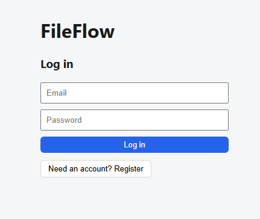
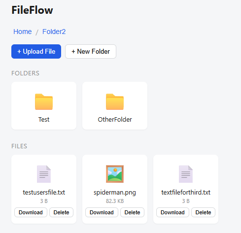

# FileFlow

A full-stack file storage and management app. Upload, organize into nested folders, search, and download files through a clean web UI, backed by a secured REST API with per-user data isolation.

Built as a portfolio project to practice production-style patterns such as JWT authentication, ownership-based authorization, server-side validation, and automated testing.

## Screenshots

### Login

### File Explorer

## Features

- Folder navigation
- File upload, download, and delete
- JWT-based authentication
- Per-user data isolation
- Server-side upload validation: file size limits, extension whitelist, and content verification
- 20 automated unit tests covering model validation and controller-level ownership rules
- CI pipeline via GitHub Actions

## Tech Stack

**Backend**
- ASP.NET Core 8 Web API
- Entity Framework Core + SQLite
- JWT Bearer authentication
- xUnit + EF Core InMemory provider for testing

**Frontend**
- React (Vite)
- Fetch-based API client with token-based authentication

## Notes
- **Self-validating models:** Entities like `FileItem`, `Folder`, and `User` validate their own inputs in their constructors rather than relying on external validation layers.
- **Ownership enforced at the controller level:** The endpoints check `UserId` ownership before doing anything. Unauthorized access returns `404` over `403` to not leak the fact that the file even exists.
- **Layered upload security:** Extension whitelist, file size limit, binary signature check, renaming `malware.exe` to `photo.png` won't slip through on filename alone.
- **Randomized on-disk filenames:** Uploaded files are stored under generated names rather than user-supplied names to prevent path traversal and filename collisions.

## Setup
- Requires: .NET 8 SDK and Node.js 20+
- Backend
- `cd FileFlow.API`
- `cp appsettings.Example.json appsettings.json`
- `openssl rand -base64 32`
- Put this key into appsettings.json
- `dotnet ef database update`
- `dotnet run`
- Frontend
- `cd FileFlow.Client`
- `npm install`
- `npm run dev`
- Running tests
- `cd FileFlow.Tests`
- `dotnet test`
